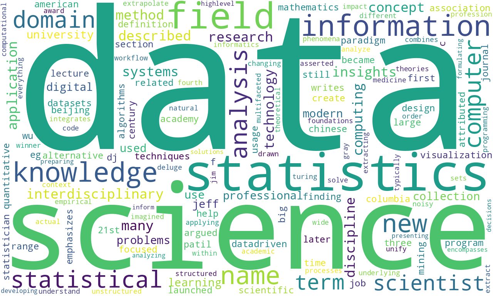

# Wordcloud from a PDF file and a Wikipedia entry

In this repo I provide a notebook to create a wordcloud I use as part of a gig image for [my first published gig in Fiverr](https://www.fiverr.com/share/XDe00D). The implementation relies on work from my colleague [Juan Fernando Varela](https://github.com/JFVJ/Lemmatization-in-Spanish-Wordcloud-) to create the wordcloud from a PDF file and the blog entry [Word Cloud in 3 Basic Steps with Python](https://gustavorsantos.medium.com/word-cloud-in-3-basic-steps-with-pythonb-c5a97537b9d6).

I also go one step further and create the wordcloud direclty from the website whose content I printed in the PDF file.

## Getting started

Please make sure to install Python and the project requirements. The requirements are listed in the file `requirements.txt` and can be installed in a Linux terminal with the following command:[^1]

[^1]: Note the `python -m` at the beggining of the command. While running `pip` this way inside a virtual environment is not necessary, it's good practice to run it this way. See [Why you should use `python -m pip`](https://snarky.ca/why-you-should-use-python-m-pip/) for an explanation about running `pip` with and without `python -m`.

```bash
python -m pip install -r requirements.txt
```

You can do the same with the file `dev-requirements.txt`. This file lists some linting and code formatting libraries that can be used with a source-code editor like VS Code.

## Notebooks

The notebook using the PDF file is `wordcloud_from_pdf.ipynb`, while the one using the website is  `wordcloud_from_website.ipynb`.  

All in all, although relatively simple, this is an interesting exercise since there's a bit of web scraping and text processing, which are tools that can come in handy in many data science projects. You can see a sample wordcloud below.

<p style="line-height:0.5" align="center">
    
</p>
<p style="line-height:0.5" align="center"><b>Figure 1.</b> Sample wordcloud.</p>

I highly appreciate feedback and you can reach out to me on [LinkedIn](https://bit.ly/jaime-linkedin) any time. I'm also working on other projects. Check this out in my [personal website](https://bit.ly/jaime-website).

Thanks for reading!
